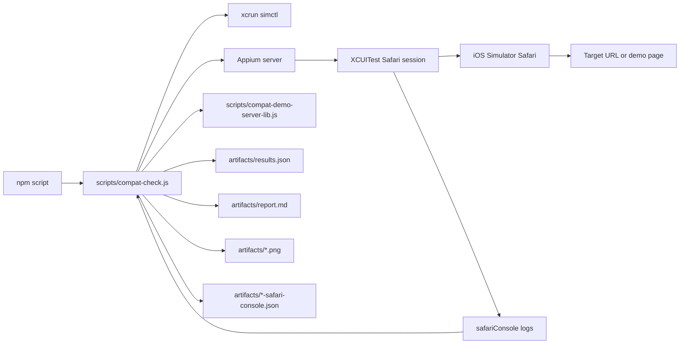
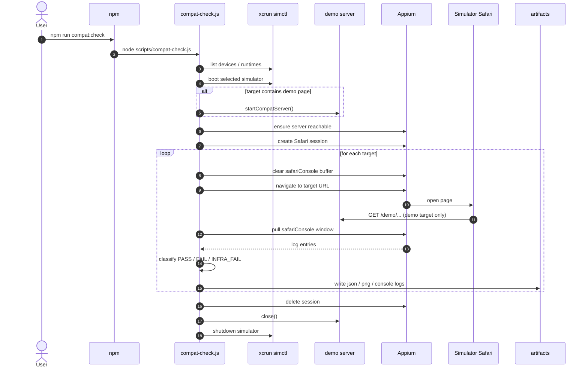

# compat-check 当前实现分析

这份文档总结当前仓库里 `compat-check` 的唯一实现，方便后续维护、迁移或让其他 agent 快速接手。

## 1. 方案结论

当前实现是一个黑盒 Safari 巡检工具，核心特征如下：

- 运行环境是 macOS + Xcode + iOS Simulator
- 驱动层是 Appium 2 + XCUITest
- 浏览器是 iOS Simulator 里的 Mobile Safari
- 错误来源是 Appium 暴露的 `safariConsole`
- 不依赖页面注入
- 不依赖页面主动回传结果

换句话说，当前工具是“打开真实页面，然后从 Safari 自己的控制台信号里判定通过或失败”。

## 2. 核心设计取舍

这套实现刻意选择了黑盒路径，因此：

- 优点是目标页面不需要配合，不必加 `compat_mode`、`report` 回调或埋点脚本
- 缺点是稳定性更依赖 Appium / XCUITest / WebKit remote debugger
- 错误数据更接近浏览器真实表现，但结构化程度比页面主动上报略弱

当前代码里也显式做了一层降噪：

- 默认不把 `source=network` 的控制台项判成失败
- 这样像 `favicon.ico` 404 这类浏览器资源噪音不会把正常页面误判成 `FAIL`

## 3. 模块结构

关键文件：

- `scripts/compat-check.js`
  唯一 runner，负责 simulator、Appium、导航、日志采集、结果输出
- `scripts/compat-demo-server.js`
  单独启动 demo 服务的入口
- `scripts/compat-demo-server-lib.js`
  demo 页面和 catalog 的本地 HTTP 服务
- `compat-check.config.json`
  最小运行配置
- `compat-check.demo-suite.json`
  全量 demo 场景配置
- `demo-pages/manifest.json`
  demo 页面目录和期望状态
- `demo-pages/*.html`
  各个 demo 场景

## 4. 结构图

## 5. 执行流程

`scripts/compat-check.js` 的主流程可以概括为：

1. 读取配置
2. 用 `simctl` 列出可用设备和 runtime
3. 选中目标 simulator 并 boot
4. 如果 target 里包含 demo 页面，则启动本地 demo server
5. 检查或自动拉起 Appium server
6. 创建 XCUITest Safari session
7. 确认当前 session 暴露了 `safariConsole` 日志能力
8. 逐个 target 执行导航和日志采集
9. 将结果写入 artifacts
10. 关闭 session、server、simulator

## 6. 时序图

## 7. runner 内部职责拆分

`scripts/compat-check.js` 里大致可以按下面几层理解：

- 设备管理
  - `getDevices`
  - `getRuntimes`
  - `pickDevice`
  - `bootDevice`
  - `shutdownDevice`

- Appium 通信
  - `requestJson`
  - `ensureAppiumServer`
  - `createAppiumSession`
  - `deleteAppiumSession`
  - `detectLogCommands`

- Safari console 归一化和判定
  - `normalizeSafariConsoleEntry`
  - `isErrorLikeEntry`
  - `toCompatError`
  - `collectSafariConsoleWindow`

- 单个 target 执行
  - `buildTargetUrl`
  - `runTarget`
  - `captureScreenshot`
  - `writeConsoleArtifact`

- 汇总输出
  - `writeArtifacts`
  - `printSummary`

## 8. demo server 的角色

`scripts/compat-demo-server-lib.js` 现在只做三件事：

- 读取 `demo-pages/manifest.json`
- 提供 `/demo/catalog`
- 提供 `/demo/<slug>` 静态 HTML

它已经不再做这些事情：

- 不注入 `compat-client.js`
- 不提供 `/report`
- 不等待页面主动回传

因此 demo server 现在只是一个“给 Safari 打开的本地页面源”。

## 9. target 类型

当前支持两种 target：

- `type: "demo"`
  runner 会把它映射到本地 demo server 的 `/demo/<page>`
- `url`
  直接打开真实业务地址

这意味着真实页面接入当前方案时，只需要把 URL 放进配置，不需要改页面逻辑。

## 10. 状态判定语义

当前状态只有三种：

- `PASS`
  导航成功，且没有命中错误分类规则
- `FAIL`
  导航成功，但 `safariConsole` 里命中了 JavaScript 侧错误
- `INFRA_FAIL`
  导航、session、日志端点、simulator 或 Appium 链路本身失败

这里最关键的一点是：

- 旧方案里“页面不回传结果”那种 `INFRA_FAIL` 已经不存在
- 现在的 `INFRA_FAIL` 只表示驱动链路或环境失败

## 11. 当前 demo 覆盖面

`compat-check.demo-suite.json` 目前覆盖了这些场景：

- 正常页
- `console.error`
- 未捕获异常
- unhandled rejection
- 多种错误混合
- 异步报错
- 不存在对象/方法/链式属性访问
- 只读 `undefined` 不报错
- `try/catch` 吞掉错误

这组 demo 的目的不是验证业务逻辑，而是稳定覆盖 runner 的错误分类边界。

## 12. 结果产物

每次运行会产出：

- `results.json`
  机器可读总结果
- `report.md`
  摘要表格
- `*.png`
  页面截图
- `*-safari-console.json`
  当前 target 的原始控制台条目

如果某个页面被误判，首先应该打开 `*-safari-console.json` 看原始信号。

## 13. 环境依赖

这套实现对环境依赖比较强，主要包括：

- Xcode 安装正确
- `simctl` 能返回设备和 runtime JSON
- Appium server 可达
- Appium 的 `xcuitest` driver 已安装

最常见的两类问题：

- `CoreSimulatorService connection invalid/refused`
  说明 Simulator 环境本身有问题
- `Could not find a driver for automationName 'XCUITest'`
  说明 Appium 环境缺少 `xcuitest` driver

## 14. 后续维护建议

如果后续还要继续演进，建议遵循下面的优先级：

1. 要加新场景时，优先新增 demo 页面和 suite target
2. 要减少误判时，优先改 `isErrorLikeEntry`
3. 要调环境行为时，优先改 config，而不是先改 runner
4. 不要重新引入页面注入或页面回传机制

## 15. 一句话总结

当前 compat-check 的本质是：

“用 Appium 驱动 iOS Simulator Safari 打开页面，再用 Safari console 自己的信号来做兼容性巡检。”
