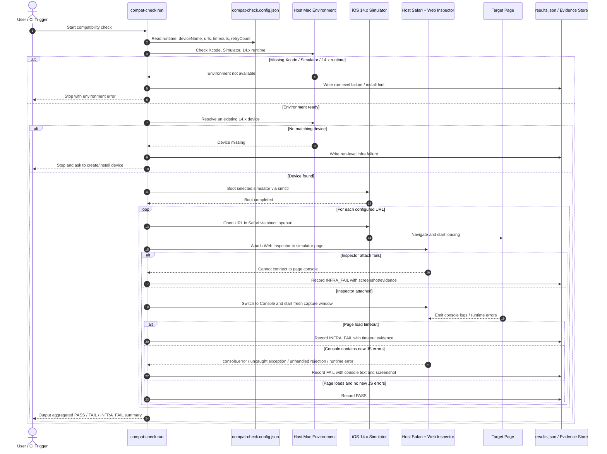

# iOS 14.x Safari 兼容性黑盒巡检方案

## Summary
目标是在本地 Mac 上实现一套“低版本 Safari 兼容性巡检”工具：启动指定的 iOS 14.x 模拟器，用 Safari 依次打开一组固定 URL，并自动判断页面加载阶段是否出现 JavaScript 控制台错误。  
这套方案按你的选择收敛为：`14.x 即可`、`黑盒访问`、`一组固定 URL`、`本地 Mac 优先`、`全自动判定`。

当前环境里还没有可用的 Xcode / iOS Simulator，所以实现前的前置条件是先补齐 Xcode 和对应的 14.x simulator runtime。

## Key Changes
### 1. 方案形态
实现一个本地命令行工具，职责固定为：
- 读取一个 URL 清单配置
- 启动指定 iOS 14.x 模拟器
- 在模拟器 Safari 中逐个打开 URL
- 通过宿主机侧的 Safari Web Inspector 连接到该模拟器页面
- 打开 Console 并抓取页面加载窗口内的新报错
- 输出每个 URL 的 `PASS / FAIL / INFRA_FAIL` 结果和证据

### 2. 推荐接口与输入输出
新增一个简单配置文件，例如 `compat-check.config.json`，字段固定为：
- `runtime`: `14.x`
- `deviceName`: 默认一个稳定机型，例如 `iPhone 8`
- `urls`: 固定 URL 数组
- `pageLoadTimeoutMs`: 页面加载超时
- `consoleCollectWindowMs`: 页面加载完成后继续观察控制台的窗口
- `retryCount`: 失败重试次数，v1 固定为 `1`

新增一个执行入口，例如：
```bash
compat-check run
```

输出一个机器可读结果文件，例如 `results.json`，每个 URL 包含：
- `url`
- `status`
- `runtimeUsed`
- `deviceName`
- `errors`
- `screenshotPath`
- `startedAt`
- `finishedAt`

### 3. 实现策略
核心流程固定为：
1. 检查 Xcode、Simulator、14.x runtime 是否存在；不存在直接失败并提示安装。
2. 解析配置，选定一台 14.x 模拟器；若没有现成设备则报缺失，不在 v1 自动创建。
3. 用 `simctl` 启动模拟器并等待完全 boot。
4. 用 `simctl openurl` 在模拟器 Safari 中打开目标 URL。
5. 在宿主机 Safari 中通过 Develop 菜单连接到该模拟器页面的 Web Inspector。
6. 切到 Console，仅采集本次页面打开后的新增错误。
7. 将以下信号记为 `FAIL`：
   - `console.error`
   - `uncaught exception`
   - `unhandled promise rejection`
   - `SyntaxError` / `TypeError` 等未捕获运行时错误
8. 若页面本身可打开，但 Inspector 无法连接或 Console 无法稳定读取，记为 `INFRA_FAIL`，不误判为通过。
9. 每个 URL 失败时保留截图和原始控制台文本片段。

### 4. 非目标与边界
v1 明确不做：
- 精确锁定到 `14.4` 单一 runtime
- 修改被测页面代码或注入埋点
- 自动发现整站链接
- 直接接入 CI
- 将“无报错”扩展解释为“所有低版本兼容性都通过”

## Sequence Chart


## Test Plan
必须覆盖这些场景：

- 正常页：页面可打开，控制台无错误，结果为 `PASS`
- 显式报错页：页面执行 `console.error(...)`，结果为 `FAIL`
- 未捕获异常页：页面抛出 JS 异常，结果为 `FAIL`
- Promise 拒绝页：页面触发未处理 rejection，结果为 `FAIL`
- 页面超时：目标 URL 长时间未完成加载，结果为 `INFRA_FAIL`
- Inspector 连接失败：Safari 页面打开了，但宿主机无法附着 Console，结果为 `INFRA_FAIL`
- 多 URL 汇总：同一轮执行中同时出现 `PASS` / `FAIL` / `INFRA_FAIL`，汇总结果正确

## Assumptions
- 版本要求按你的偏好固定为 `14.x`，不是强制 `14.4`
- 黑盒测试前提下，v1 选择“抓取 Safari Web Inspector Console”作为唯一错误来源
- 本地 Mac 是主运行环境，CI 不进入 v1
- 当前机器尚未安装可用 Xcode / Simulator，这属于实现前置依赖
- 如果机器上拿不到任何 14.x runtime，则整套工具直接报环境不满足，不自动降到 15.x+
- 若后续你希望更稳定、更适合 CI，下一阶段应切到“测试构建注入错误采集”的方案，而不是继续强化黑盒抓 Console
