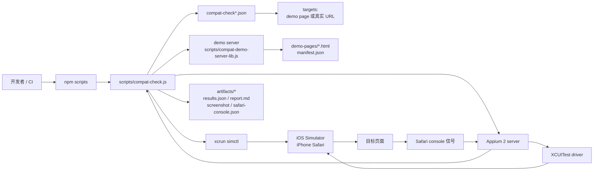
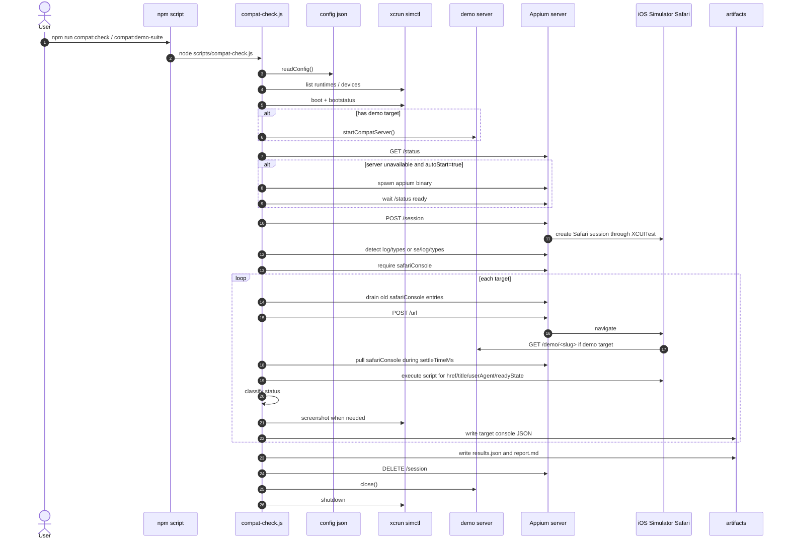
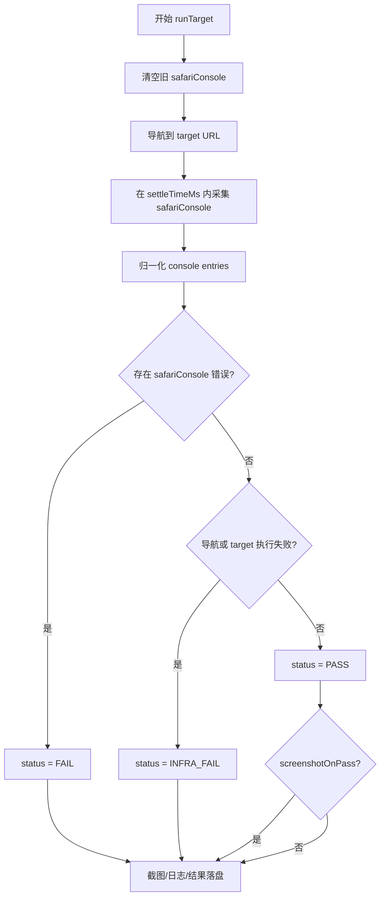
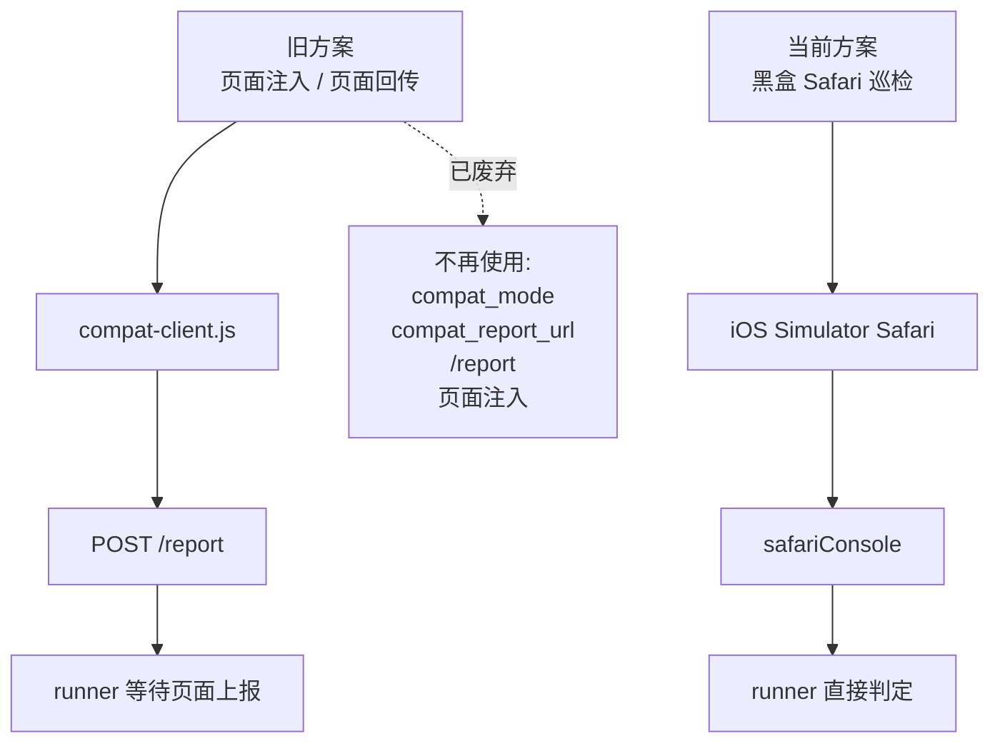

# auto-js-browser-test 当前仓库实现总结

本文档总结当前仓库截至 2026-04-24 的实现状态、运行链路、文件职责、配置方式、demo 覆盖和产物格式。它的目标是让后续维护者可以不读完整源码，也能理解这个仓库在做什么、怎么做、哪些部分是当前主线、哪些东西只是遗留或生成产物。

## 1. 一句话结论

当前仓库实现的是一个 iOS Simulator Safari 黑盒兼容性巡检工具：

> 用 Appium 2 + XCUITest 驱动 iOS 模拟器里的 Safari 打开页面，再读取 Appium 暴露的 `safariConsole` 日志，按控制台信号判断页面是否 `PASS`、`FAIL` 或 `INFRA_FAIL`。

它不要求被测页面配合，不注入脚本，不等待页面上报结果。

## 2. 当前仓库实际做的事情

仓库保留了一条主线能力：运行 `compat-check`。

它会完成下面这些事情：

1. 读取本地 JSON 配置。
2. 通过 `xcrun simctl` 找到指定 iOS Simulator。
3. 启动并等待 simulator boot 完成。
4. 如 target 包含内置 demo，则启动本地 demo HTTP server。
5. 检查 Appium server 是否可用；若不可用且配置允许，则自动启动 Appium。
6. 创建 iOS Safari WebDriver session。
7. 探测 WebDriver 日志端点，确认可读取 `safariConsole`。
8. 逐个 target 打开页面。
9. 在页面加载后等待一段 settle window，持续拉取 Safari console 日志。
10. 归一化日志条目并按规则分类错误。
11. 根据错误和导航状态得出 `PASS` / `FAIL` / `INFRA_FAIL`。
12. 按 target 写入控制台日志 JSON、截图、汇总 `results.json` 和 `report.md`。
13. 清理 Appium session、本地 demo server、自动启动的 Appium 进程和 simulator。

当前明确不做这些事情：

- 不追加 `compat_mode=1`。
- 不注入 `compat-client.js`。
- 不提供或等待页面 POST `/report`。
- 不把页面主动上报作为结果来源。
- 不把普通 `console.warn` 视为失败。
- 默认不把 `source=network` 的日志项视为失败，避免 `favicon.ico` 404 这类噪音误判。

## 3. 技术栈和外部依赖

代码层面：

- Node.js CommonJS 脚本。
- 只使用 Node 内置模块：`fs`、`http`、`https`、`path`、`child_process`。
- `package-lock.json` 中没有第三方 npm package。

运行环境依赖：

- macOS。
- Xcode 和 iOS Simulator。
- `xcrun simctl` 可用。
- Appium 2。
- Appium `xcuitest` driver。
- 可用的 iPhone simulator，例如当前配置中的 `iPhone 17 Pro`。

关键外部命令：

```bash
xcrun simctl list devices available -j
xcrun simctl list runtimes -j
xcrun simctl boot <udid>
xcrun simctl bootstatus <udid> -b
xcrun simctl io <udid> screenshot <path>
xcrun simctl shutdown <udid>
appium --address <host> --port <port>
```

## 4. 顶层文件和目录职责

| 路径 | 当前职责 | 是否主线 |
| --- | --- | --- |
| `package.json` | 定义 4 个 npm scripts，描述项目用途。 | 是 |
| `package-lock.json` | npm lockfile；当前没有实际依赖包。 | 辅助 |
| `README.md` | 用户入口文档，说明命令、环境要求和维护原则。 | 是 |
| `COMPAT_CHECK_IMPLEMENTATION.md` | 已有实现分析文档，聚焦 compat-check 的黑盒方案。 | 是 |
| `REPOSITORY_SUMMARY.md` | 本文档，更完整地总结仓库结构和运行行为。 | 是 |
| `compat-check.config.json` | 默认最小巡检配置，跑 `demo-ok` 和 `demo-runtime-error`。 | 是 |
| `compat-check.demo-suite.json` | 完整 demo suite 配置，覆盖全部 demo 页面。 | 是 |
| `scripts/compat-check.js` | 核心 runner，负责 simulator、Appium、Safari session、日志采集、结果判定和产物写入。 | 是 |
| `scripts/compat-demo-server-lib.js` | 本地 demo server 的可复用库，读取 manifest 并提供 demo 页面。 | 是 |
| `scripts/compat-demo-server.js` | 单独启动 demo server 的 CLI 包装。 | 是 |
| `demo-pages/manifest.json` | demo 场景目录，声明预期状态和说明。 | 是 |
| `demo-pages/*.html` | 内置 demo 页面，用来验证错误分类边界。 | 是 |
| `artifacts/` | 运行结果产物目录；被 `.gitignore` 忽略。 | 生成产物 |
| `dist/` | 当前存在两份示例 bundle，但被 `.gitignore` 忽略，且没有被 runner 主线引用。 | 非主线/遗留产物 |
| `node_modules/` | 本地依赖目录；被 `.gitignore` 忽略。 | 本地环境 |

## 5. npm 命令

| 命令 | 实际执行 | 用途 |
| --- | --- | --- |
| `npm run compat:check` | `node scripts/compat-check.js` | 使用 `compat-check.config.json` 跑最小检查。 |
| `npm run compat:demo-suite` | `node scripts/compat-check.js --config compat-check.demo-suite.json` | 跑完整 demo 集合。 |
| `npm run compat:config` | `node scripts/compat-check.js --print-default-config` | 打印脚本内置默认配置。 |
| `npm run compat:serve-demo` | `node scripts/compat-demo-server.js` | 只启动 demo HTTP server，便于手动查看页面。 |

## 6. 总体架构图



## 7. 执行时序图



## 8. 核心 runner：`scripts/compat-check.js`

这个文件是当前仓库最重要的实现，约 1000 行，承担所有巡检主逻辑。

### 8.1 参数和配置

支持的 CLI 参数很少：

- `--config <path>`：指定配置文件，默认 `compat-check.config.json`。
- `--print-default-config`：打印脚本内置 `DEFAULT_CONFIG`。

配置读取逻辑：

- 若指定配置文件不存在，直接使用脚本内置默认配置。
- 若配置文件存在，则浅合并顶层字段。
- `appium` 字段会和默认 `appium` 配置合并。
- `appium.capabilities` 也会继续合并，允许局部覆盖或扩展 capability。
- `targets` 如果在配置文件中出现，会整体替换默认 targets。

### 8.2 默认配置要点

脚本内置默认值包括：

- `simulatorName`: `iPhone 17 Pro`
- `runtimePrefix`: `iOS`
- `loadTimeoutMs`: `20000`
- `settleTimeMs`: `3000`
- `artifactDir`: `artifacts/compat-check`
- `screenshotOnPass`: `false`
- `appium.serverUrl`: 默认 `http://127.0.0.1:4723`，可由 `APPIUM_SERVER_URL` 覆盖。
- `appium.binary`: 默认 `appium`，可由 `APPIUM_BINARY` 覆盖。
- `appium.autoStart`: `true`
- `appium.showSafariConsoleLog`: `true`
- `appium.failOnNetworkErrors`: `false`

仓库里的 `compat-check.config.json` 覆盖了 `screenshotOnPass: true`，所以最小 demo 跑通时也会保存 PASS 截图。

### 8.3 simulator 管理

runner 通过这些函数管理模拟器：

- `getDevices()`：执行 `xcrun simctl list devices available -j`。
- `getRuntimes()`：执行 `xcrun simctl list runtimes -j`。
- `pickDevice()`：优先按 `simulatorName` 和 `runtimePrefix` 匹配可用设备；找不到配置名时自动 fallback。
- `bootDevice()`：执行 `simctl boot`，再用 `simctl bootstatus -b` 等待完成。
- `shutdownDevice()`：任务结束后尝试关闭 simulator。

设备选择逻辑会过滤：

- runtime 必须可用。
- runtime 名称必须以 `runtimePrefix` 开头。
- device 必须可用。

选择优先级：

1. 精确匹配配置中的 `simulatorName`。
2. 同一 `runtimePrefix` 下可用的 iPhone simulator。
3. 同一 `runtimePrefix` 下任意可用 simulator。

fallback 会优先选择已 boot 的设备；如果没有已 boot 设备，则优先选择平台版本更新的设备。发生 fallback 时，CLI 会输出 requested simulator 和实际使用的 simulator，`results.json` 也会记录 `requestedName` 和 `fallbackUsed`。

如果完全找不到可用设备，错误信息会包含当前可用 runtimes，便于定位环境问题。

### 8.4 Appium server 管理

runner 会先请求 `<serverUrl>/status`：

- 如果已有 Appium server 可达，直接复用。
- 如果不可达且 `appium.autoStart` 为 `false`，直接失败。
- 如果不可达且 `appium.autoStart` 为 `true`，用 `child_process.spawn()` 拉起配置的 `appium.binary`。

自动启动 Appium 时会：

- 从 `serverUrl` 解析 `--address` 和 `--port`。
- 如果 URL 带 base path，则补 `--base-path`。
- 拼接 `appium.serverArgs`。
- 捕获最近 200 行 stdout/stderr。
- 等待 `/status` 在 `startupTimeoutMs` 内 ready。
- 如果启动失败，错误会附带最近 Appium 输出。

### 8.5 Appium session 和 capabilities

创建 session 时使用 W3C capabilities：

```json
{
  "platformName": "iOS",
  "browserName": "safari",
  "appium:automationName": "XCUITest",
  "appium:deviceName": "<device.name>",
  "appium:udid": "<device.udid>",
  "appium:platformVersion": "<runtime version>",
  "appium:showSafariConsoleLog": true,
  "appium:skipLogCapture": false,
  "appium:webviewConnectTimeout": 10000,
  "appium:wdaLaunchTimeout": 120000,
  "appium:safariInitialUrl": "about:blank",
  "pageLoadStrategy": "normal"
}
```

也支持通过 `appium.capabilities` 注入额外 capability 或覆盖默认值。

session 创建后会设置 timeout：

- `pageLoad`: `config.loadTimeoutMs`
- `script`: `max(config.loadTimeoutMs, 10000)`
- `implicit`: `0`

如果 Appium 返回典型 XCUITest driver 缺失错误，runner 会增强错误信息，并提示：

```bash
appium driver install xcuitest
```

### 8.6 WebDriver 日志端点探测

runner 不写死日志端点，而是按顺序探测：

1. `GET /session/<id>/log/types` + `POST /session/<id>/log`
2. `GET /session/<id>/se/log/types` + `POST /session/<id>/se/log`

探测到可用类型后，如果 `appium.showSafariConsoleLog` 为 `true`，必须包含 `safariConsole`。否则会认为当前 session 不具备核心采集能力。

### 8.7 target URL 构造

当前支持两类 target：

```json
{
  "name": "demo-runtime-error",
  "type": "demo",
  "page": "runtime-error"
}
```

demo target 会映射到：

```text
http://127.0.0.1:<demoServerPort>/demo/<page>
```

真实页面 target：

```json
{
  "name": "checkout-page",
  "url": "https://example.com/checkout"
}
```

真实页面不会被追加任何测试态 query，也不要求页面实现额外接口。

### 8.8 单个 target 的运行逻辑

`runTarget()` 的核心步骤：

1. 构造 target URL。
2. 先 drain 一次旧的 `safariConsole`，避免上一个页面日志污染本次结果。
3. 通过 WebDriver `POST /url` 导航。
4. 即使导航失败，也继续收集 `settleTimeMs` 内的 Safari console。
5. 执行一段同步脚本读取页面信息：
   - `window.location.href`
   - `document.title`
   - `navigator.userAgent`
   - `document.readyState`
6. 归一化 console entries。
7. 按错误规则筛出 runtime errors。
8. 如导航失败，补一条 `type: infra` 错误。
9. 得出 target status。
10. 必要时截图。
11. 写入该 target 的 `*-safari-console.json`。
12. 返回结构化 result。

## 9. Safari console 归一化和错误判定

### 9.1 日志归一化

Appium 的 `safariConsole` entry 可能是字符串、JSON 字符串或嵌套对象。runner 会做这些处理：

- 尝试解析 JSON 字符串。
- 从常见字段中收集文本片段：
  - `messageText`
  - `message`
  - `text`
  - `description`
  - `reason`
  - `value`
  - `type`
  - `subtype`
  - `url`
- 标准化 timestamp。
- 提取 level。
- 提取 stack。
- 提取 source URL。
- 保留 raw entry。

归一化后的结构大致是：

```json
{
  "timestamp": "2026-04-23T16:12:07.000Z",
  "level": "error",
  "message": "...",
  "stack": "...",
  "source": "http://127.0.0.1:...",
  "sourceType": "...",
  "raw": {}
}
```

### 9.2 错误判定规则

`isErrorLikeEntry()` 会先做网络噪声过滤：

- 如果 `sourceType === "network"` 且 `appium.failOnNetworkErrors === false`，则不判为失败。

随后按 level 和 message 判断：

- level 中包含 `error`、`severe`、`fatal` 会判为错误。
- message/level 中包含这些特征也会判为错误：
  - `console.error`
  - `uncaught`
  - `unhandled rejection`
  - `unhandled promise rejection`
  - `syntaxerror`
  - `typeerror`
  - `referenceerror`
  - `rangeerror`
  - `urierror`
  - `evalerror`
  - `aggregateerror`
  - `error:`

匹配到的 console entry 会被转换为 compat error：

```json
{
  "type": "safariConsole",
  "message": "...",
  "stack": "...",
  "source": "...",
  "line": null,
  "column": null,
  "timestamp": "...",
  "level": "error"
}
```

## 10. 状态判定流程图



状态语义：

| 状态 | 含义 |
| --- | --- |
| `PASS` | 页面导航成功，采集窗口内没有命中错误规则。 |
| `FAIL` | 页面导航完成或基本可运行，但 Safari console 中出现 JS runtime/console error。 |
| `INFRA_FAIL` | 驱动链路或环境失败，例如导航、session、日志端点、simulator、Appium 等问题。 |

重要细节：

- 如果同一个 target 同时有导航错误和 runtime console 错误，当前状态优先为 `FAIL`，因为代码先判断是否存在 `type: safariConsole` 错误。
- target 级别异常会被 `buildInfraFailureResult()` 转成该 target 的 `INFRA_FAIL`，不会直接中断后续 target。
- session 创建、设备选择等全局前置步骤失败时，整个命令会失败退出。

## 11. demo server

### 11.1 `scripts/compat-demo-server-lib.js`

这个文件提供本地 HTTP server：

- 读取 `demo-pages/manifest.json`。
- 提供 `/demo/catalog` 页面。
- 提供 `/demo/<slug>` 页面。
- 对 `/favicon.ico` 返回 `204`，减少网络噪声。
- 对未知 demo 返回 404 和简单说明页。

它导出：

- `loadDemoManifest()`
- `startCompatServer(options)`

`startCompatServer()` 返回：

```js
{
  port,
  manifest,
  close: async () => {}
}
```

### 11.2 `scripts/compat-demo-server.js`

这是一个 CLI 包装：

- 默认端口 `4173`。
- 支持 `--port <number>`。
- 启动后打印 base URL、catalog URL 和所有 demo 页面列表。
- 监听 `SIGINT` / `SIGTERM` 并优雅关闭 server。

手动查看 demo：

```bash
npm run compat:serve-demo
```

然后打开：

```text
http://127.0.0.1:4173/demo/catalog
```

## 12. demo 页面覆盖面

当前 `demo-pages/manifest.json` 定义了 13 个场景。

| slug | 预期状态 | 场景目的 |
| --- | --- | --- |
| `ok` | `PASS` | 基线正常页面，不产生 runtime error。 |
| `warning-only` | `PASS` | 只调用 `console.warn`，验证 warning 不导致失败。 |
| `console-error` | `FAIL` | 调用一次 `console.error`，验证 console error 会失败。 |
| `runtime-error` | `FAIL` | load 后抛出未捕获 `Error`。 |
| `promise-rejection` | `FAIL` | 触发 unhandled Promise rejection。 |
| `mixed-errors` | `FAIL` | 同时产生 `console.error` 和 rejected Promise。 |
| `async-runtime-error` | `FAIL` | 延迟更久后异步抛错，验证 settle window。 |
| `missing-base-object` | `FAIL` | 对 undefined base object 访问属性，例如 `window.__compatMissingBase.bbb`。 |
| `missing-method-call` | `FAIL` | 调用不存在的方法，例如 `service.bbb()`。 |
| `missing-nested-property-call` | `FAIL` | 访问缺失嵌套属性并调用，例如 `data.user.bbb.ccc()`。 |
| `missing-nested-property-log` | `FAIL` | 执行 `console.log(a.xxx.bbb)`，中间属性为 undefined。 |
| `missing-property-read-only` | `PASS` | 只读取不存在属性，得到 `undefined` 但不抛错。 |
| `caught-runtime-error` | `PASS` | 在 `try/catch` 内抛错并吞掉，验证全局 collector 不应失败。 |

这组 demo 的目的不是验证业务功能，而是稳定验证错误分类边界。

## 13. 配置文件

### 13.1 `compat-check.config.json`

最小默认运行配置：

- simulator: `iPhone 17 Pro`
- runtime prefix: `iOS`
- load timeout: `20000ms`
- settle window: `3000ms`
- artifact dir: `artifacts/compat-check`
- pass 也截图：`true`
- targets:
  - `demo-ok`
  - `demo-runtime-error`

用途：快速验证工具链是否可用，并覆盖一个 PASS 与一个 FAIL。

### 13.2 `compat-check.demo-suite.json`

完整 demo suite：

- load timeout: `12000ms`
- settle window: `3000ms`
- artifact dir: `artifacts/compat-check-demo-suite`
- pass 也截图：`true`
- targets: 覆盖全部 13 个 demo。

用途：验证错误分类逻辑和 demo 页面预期是否匹配。

### 13.3 可配置重点

最常调整的字段：

| 字段 | 用途 |
| --- | --- |
| `simulatorName` | 首选 iOS Simulator 名称；找不到时会自动退到可用 simulator。 |
| `runtimePrefix` | 指定 runtime 名称前缀，例如 `iOS`。 |
| `loadTimeoutMs` | 页面导航超时。 |
| `settleTimeMs` | 页面打开后继续收集 console 的窗口。 |
| `artifactDir` | 结果输出目录。 |
| `screenshotOnPass` | PASS 时是否也截图。 |
| `appium.serverUrl` | Appium server 地址。 |
| `appium.autoStart` | Appium 不存在时是否自动启动。 |
| `appium.failOnNetworkErrors` | 是否将 network 来源日志算作失败。 |
| `appium.capabilities` | 追加或覆盖 Appium capabilities。 |
| `targets` | 要巡检的 demo 或真实页面。 |

## 14. 结果产物

运行后会在 `artifactDir` 下写入：

| 文件 | 内容 |
| --- | --- |
| `results.json` | 机器可读总结果，包含 simulator、collector、Appium、totals 和每个 target 的结果。 |
| `report.md` | 人类可读摘要表格。 |
| `<target>-safari-console.json` | 单个 target 的归一化 Safari console entries。 |
| `<target>-pass.png` | PASS 截图，只有 `screenshotOnPass=true` 时保存。 |
| `<target>-fail.png` | FAIL 截图。 |
| `<target>-infra_fail.png` | 理论上的 infra fail 截图文件名；当前代码实际用 `status.toLowerCase()`，因此是 `infra_fail`。 |

单个 result 结构包含：

```json
{
  "name": "demo-runtime-error",
  "url": "http://127.0.0.1:.../demo/runtime-error",
  "status": "FAIL",
  "runtimeName": "iOS 26.3",
  "simulatorName": "iPhone 17 Pro",
  "errors": [],
  "title": "runtime-error",
  "userAgent": "...",
  "readyState": "complete",
  "screenshotPath": "...",
  "consoleLogPath": "...",
  "reportedAt": "...",
  "collectionBackend": "appium:safariConsole"
}
```

当前仓库里已有两组被 `.gitignore` 忽略的本地运行产物：

- `artifacts/compat-check/`
- `artifacts/compat-check-demo-suite/`

从现有 `report.md` 看，最近一次完整 demo suite 运行环境和结果是：

- 生成时间：`2026-04-23T16:12:07.783Z`
- Simulator：`iPhone 17 Pro`
- Runtime：`iOS 26.3`
- Collector：`appium:safariConsole`
- 结果：4 个 `PASS`，9 个 `FAIL`，0 个 `INFRA_FAIL`

完整 demo suite 的结果符合 manifest 预期。

## 15. 当前完整 demo suite 结果表

现有 `artifacts/compat-check-demo-suite/report.md` 记录如下：

| Target | Status | Errors |
| --- | --- | --- |
| `demo-ok` | `PASS` | 0 |
| `demo-warning-only` | `PASS` | 0 |
| `demo-console-error` | `FAIL` | 1 |
| `demo-runtime-error` | `FAIL` | 1 |
| `demo-promise-rejection` | `FAIL` | 1 |
| `demo-mixed-errors` | `FAIL` | 2 |
| `demo-async-runtime-error` | `FAIL` | 1 |
| `demo-missing-base-object` | `FAIL` | 1 |
| `demo-missing-method-call` | `FAIL` | 1 |
| `demo-missing-nested-property-call` | `FAIL` | 1 |
| `demo-missing-nested-property-log` | `FAIL` | 1 |
| `demo-missing-property-read-only` | `PASS` | 0 |
| `demo-caught-runtime-error` | `PASS` | 0 |

## 16. `dist/` 目录现状

`dist/` 下当前有：

- `modern-broken.js`
- `modern-broken.min.js`
- `legacy-safe.js`
- `legacy-safe.min.js`

其中：

- `modern-broken.js` 使用 class static initialization block，明显是为了表达现代语法兼容性风险。
- `legacy-safe.js` 保持 ES5 风格。

但当前 `scripts/compat-check.js` 和 demo server 都没有引用 `dist/`。并且 `.gitignore` 忽略了 `dist/`。因此它们更像早期语法兼容实验的生成产物或遗留样例，不属于当前 Appium + Safari console 主线。

## 17. 旧方案与当前方案对比



当前方案的取舍：

| 维度 | 当前黑盒方案 |
| --- | --- |
| 页面改造成本 | 很低，不需要业务页面配合。 |
| 真实度 | 高，信号来自 Safari 自己的 console。 |
| 结构化程度 | 中等，依赖 Appium/WebKit 日志形态，需要归一化。 |
| 环境稳定性 | 更依赖 macOS、Simulator、Appium、XCUITest。 |
| 误判控制 | 主要在日志分类函数中维护。 |

## 18. 常见失败点

| 现象 | 可能原因 | 处理方向 |
| --- | --- | --- |
| `xcrun simctl ...` 失败 | Xcode / Simulator 环境异常。 | 先修 Xcode、Command Line Tools 或 CoreSimulatorService。 |
| 找不到 simulator | `runtimePrefix` 下没有任何可用设备，或 Simulator 环境异常。 | 改配置、安装对应 runtime，或修复 Simulator 环境。 |
| Appium 不可达 | server 没起，或 `serverUrl` 错。 | 让 runner autoStart，或手动启动 Appium。 |
| 缺少 XCUITest driver | Appium 环境没装 `xcuitest`。 | `appium driver install xcuitest`。 |
| 没有 `safariConsole` | Appium capability 或 driver/log endpoint 不支持。 | 检查 `showSafariConsoleLog`、driver 版本和 session capabilities。 |
| 正常页面被 favicon 404 搞成失败 | network 日志被算入错误。 | 保持 `failOnNetworkErrors=false`。 |
| 异步错误没被抓到 | `settleTimeMs` 太短。 | 增大 `settleTimeMs`。 |
| 页面加载慢导致 infra fail | `loadTimeoutMs` 太短或网络慢。 | 增大 `loadTimeoutMs`，区分页面问题和基础设施问题。 |

## 19. 后续扩展方式

### 19.1 新增 demo 场景

需要同步修改：

1. 新增 `demo-pages/<slug>.html`。
2. 更新 `demo-pages/manifest.json`，写明 `expectedStatus` 和描述。
3. 更新 `compat-check.demo-suite.json`，新增对应 target。
4. 运行 `npm run compat:demo-suite` 验证结果。

### 19.2 接入真实页面

新增或修改配置文件中的 target：

```json
{
  "name": "checkout-page",
  "url": "https://example.com/checkout"
}
```

当前方案不需要页面添加任何脚本，也不需要配合回传。

### 19.3 调整误判

优先修改：

- `normalizeSafariConsoleEntry()`
- `isErrorLikeEntry()`
- `toCompatError()`

建议新增对应 demo 覆盖边界，避免修一个误判又引入新的漏报。

### 19.4 调整环境行为

优先改配置，而不是改 runner：

- simulator 名称。
- runtime 前缀。
- Appium server 地址。
- timeouts。
- Appium capabilities。

## 20. 维护原则

当前仓库的主线非常清晰，维护时建议遵守：

- 继续保持黑盒巡检，不重新引入页面注入。
- 真实页面接入只通过 URL 配置完成。
- demo server 只负责提供页面，不承担结果收集职责。
- 结果判定只来自 `safariConsole` 和基础设施状态。
- 误判修复应优先沉淀为 demo case。
- `artifacts/` 是运行产物，不作为源码维护。
- `dist/` 目前不是主线依赖，除非重新设计语法兼容测试，否则不要围绕它扩展 runner。

## 21. 快速上手检查清单

环境检查：

```bash
xcode-select -p
xcrun simctl list runtimes -j
xcrun simctl list devices available -j
appium driver list --installed
```

如缺少 XCUITest driver：

```bash
appium driver install xcuitest
```

打印默认配置：

```bash
npm run compat:config
```

跑最小检查：

```bash
npm run compat:check
```

跑完整 demo：

```bash
npm run compat:demo-suite
```

只启动 demo server：

```bash
npm run compat:serve-demo
```

查看产物：

```text
artifacts/compat-check/results.json
artifacts/compat-check/report.md
artifacts/compat-check-demo-suite/results.json
artifacts/compat-check-demo-suite/report.md
```
