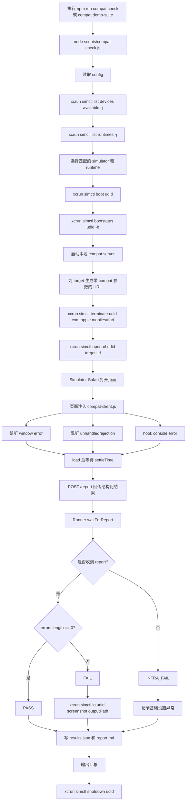
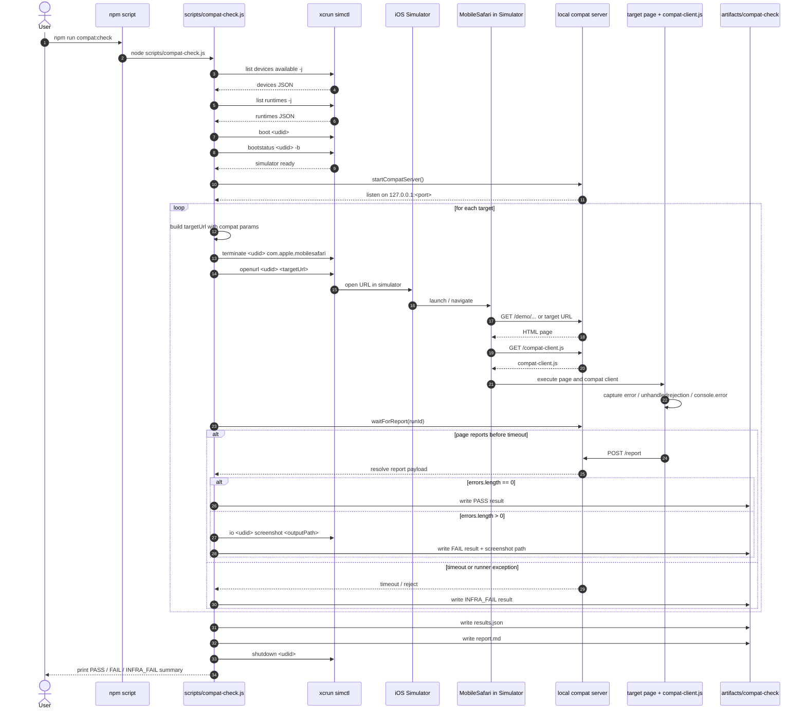

# Safari 模拟器自动化检测流程图

这份流程图描述的是当前仓库里已经落地的实际执行链路，不是 `PLAN.md` 中早期设想的 Web Inspector 抓取方案。

## 实际 CLI 命令

用户入口命令：

- `npm run compat:check`
- `npm run compat:demo-suite`
- `npm run compat:serve-demo`
- `npm run compat:config`

Runner 内部调用的关键系统命令：

- `xcrun simctl list devices available -j`
- `xcrun simctl list runtimes -j`
- `xcrun simctl boot <udid>`
- `xcrun simctl bootstatus <udid> -b`
- `xcrun simctl terminate <udid> com.apple.mobilesafari`
- `xcrun simctl openurl <udid> <targetUrl>`
- `xcrun simctl io <udid> screenshot <outputPath>`
- `xcrun simctl shutdown <udid>`

## 整体流程图

## 时序图

## 说明

- 当前实现没有接 Safari Web Inspector。
- 错误来源是页面内注入脚本采集到的：
  - `window error`
  - `unhandledrejection`
  - `console.error`
- 结果产物默认写到 `artifacts/compat-check/`。
