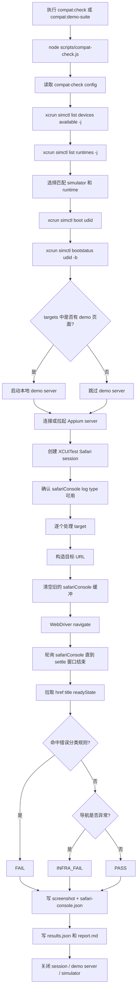
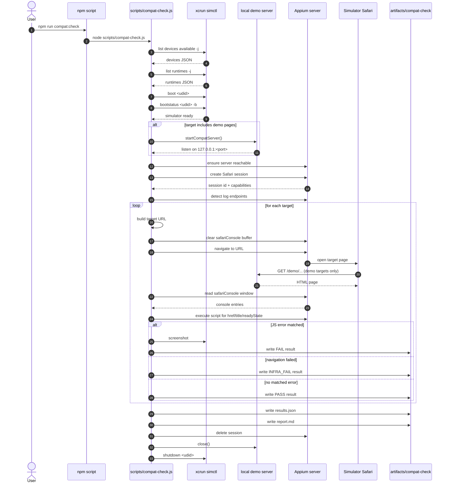

# Safari 模拟器自动化检测流程图

这份流程图描述的是仓库里当前唯一保留的 compat-check 方案：

- Appium 2
- XCUITest
- iOS Simulator Safari
- `safariConsole` 日志采集

## CLI 入口

- `npm run compat:check`
- `npm run compat:demo-suite`
- `npm run compat:config`
- `npm run compat:serve-demo`

## 关键系统调用

- `xcrun simctl list devices available -j`
- `xcrun simctl list runtimes -j`
- `xcrun simctl boot <udid>`
- `xcrun simctl bootstatus <udid> -b`
- Appium `POST /session`
- Appium `POST /session/:id/url`
- Appium log endpoints for `safariConsole`
- `xcrun simctl io <udid> screenshot <outputPath>`
- `DELETE /session/:id`
- `xcrun simctl shutdown <udid>`

## 整体流程图

## 时序图

## 说明

- 当前实现不会给页面加 `compat_mode`
- 当前实现不会等待页面 POST `/report`
- 当前实现的 demo server 只负责静态提供页面和目录
- 结果来源是 Safari console，不是页面主动上报
